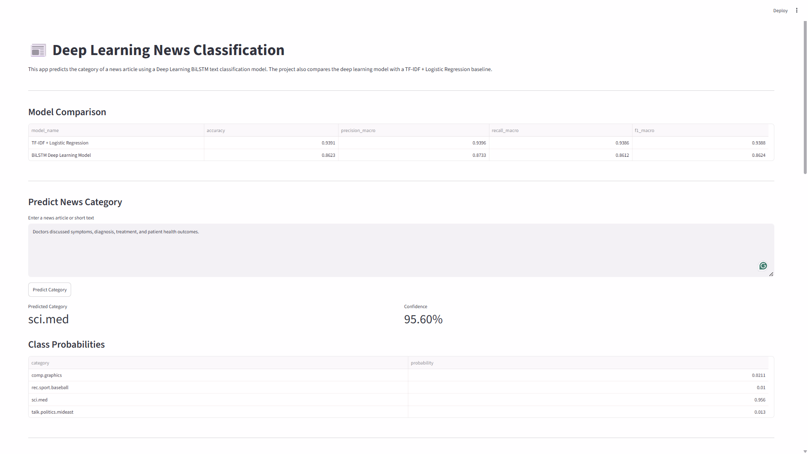
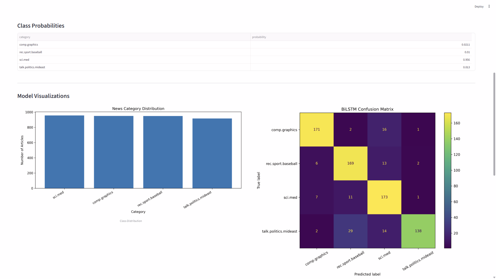
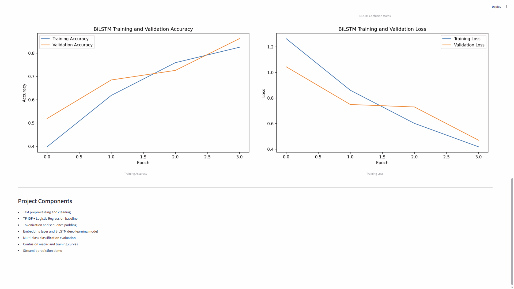
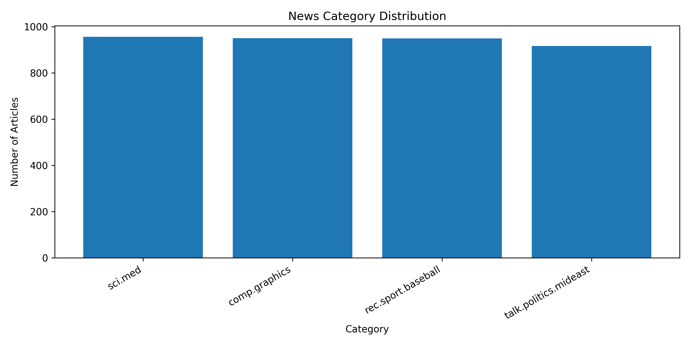
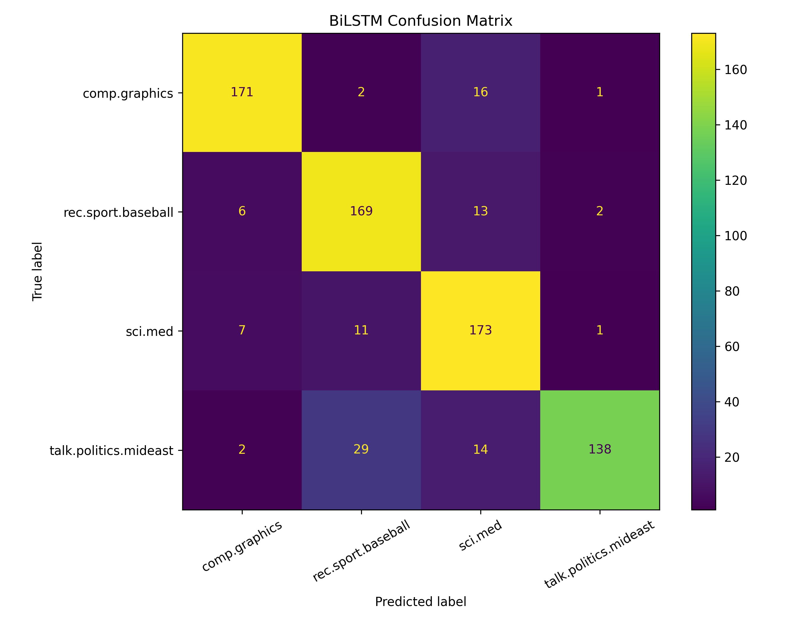
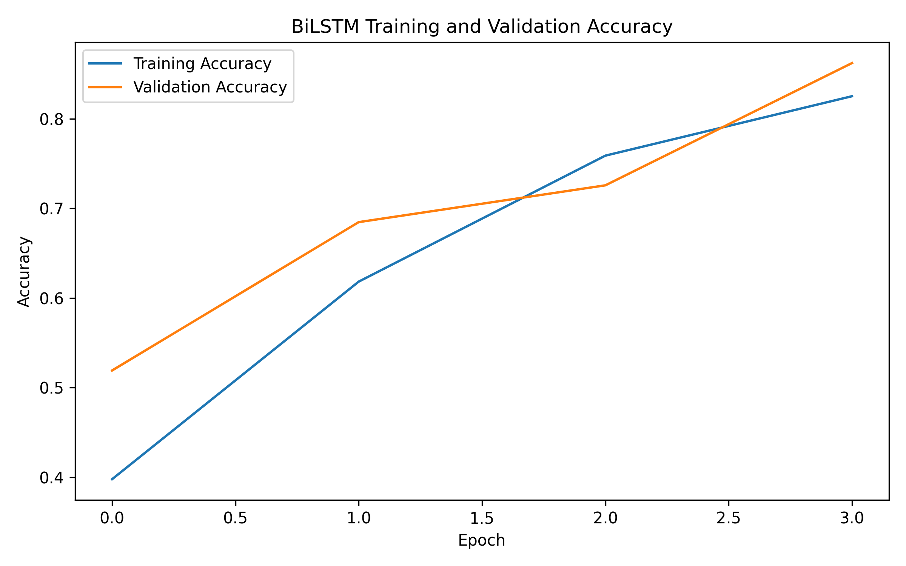
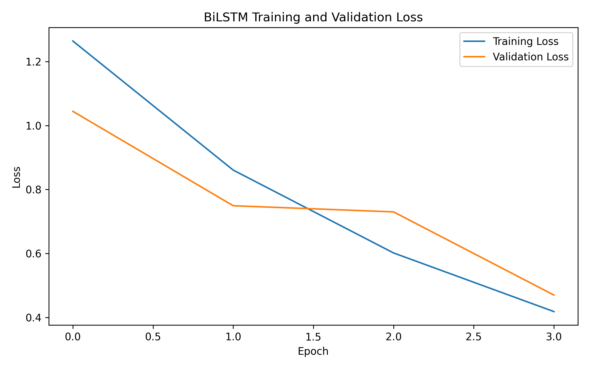

# Deep Learning News Classification

A deep learning NLP project for multi-class news category classification using a TF-IDF baseline model and a BiLSTM neural network.

This project demonstrates text preprocessing, classical machine learning baseline comparison, deep learning sequence modeling, model evaluation, visualization, and a Streamlit prediction demo.

---

## Project Overview

News classification is a common Natural Language Processing task where the goal is to automatically assign a news article or text document to the correct category.

This project classifies text into selected 20 Newsgroups categories:

- `comp.graphics`
- `rec.sport.baseball`
- `sci.med`
- `talk.politics.mideast`

The project includes:

- Text loading using the 20 Newsgroups dataset
- Text cleaning and preprocessing
- TF-IDF + Logistic Regression baseline model
- Tokenization and sequence padding
- Embedding layer + BiLSTM deep learning model
- Baseline vs deep learning model comparison
- Accuracy, precision, recall, and F1-score evaluation
- Classification report
- Confusion matrix
- Training accuracy and loss curves
- Streamlit app for real-time news category prediction

---

## Why This Project Matters

Deep learning is powerful, but it is not always better than strong classical machine learning baselines.

This project compares a traditional NLP model with a deep learning model:

```text
TF-IDF + Logistic Regression
vs
Embedding + BiLSTM
```

The baseline model outperformed the BiLSTM model on this dataset, which shows the importance of model comparison and not assuming that deep learning is always the best solution.

---

## Dataset

The project uses a selected subset of the `20 Newsgroups` dataset from scikit-learn.

Selected categories:

```text
comp.graphics
rec.sport.baseball
sci.med
talk.politics.mideast
```

After preprocessing:

| Metric | Value |
|---|---:|
| Training samples | 3,016 |
| Test samples | 755 |
| Number of classes | 4 |

---

## Project Structure

```text
deep-learning-news-classification/
│
├── app/
│   └── streamlit_app.py
│
├── data/
│   ├── raw/
│   └── processed/
│
├── models/
│   ├── baseline_tfidf_logistic_model.joblib
│   ├── label_encoder.joblib
│   ├── news_bilstm_model.keras
│   └── tokenizer.joblib
│
├── results/
│   ├── figures/
│   │   ├── class_distribution.png
│   │   ├── confusion_matrix.png
│   │   ├── training_accuracy.png
│   │   └── training_loss.png
│   │
│   ├── classification_report.csv
│   └── metrics.csv
│
├── screenshots/
│   ├── news_classification_prediction_demo.png
│   ├── news_classification_visualizations.png
│   └── news_classification_training_curves.png
│
├── src/
│   ├── __init__.py
│   ├── config.py
│   ├── data_loader.py
│   ├── preprocessing.py
│   ├── baseline_model.py
│   ├── deep_model.py
│   ├── evaluation.py
│   ├── predict.py
│   └── visualization.py
│
├── .gitignore
├── main.py
├── README.md
└── requirements.txt
```

---

## Methodology

### 1. Data Loading

The project loads a selected subset of the 20 Newsgroups dataset using scikit-learn.

The selected classes represent different domains:

- Computer graphics
- Baseball sports news
- Medical discussion
- Middle East politics

---

### 2. Text Preprocessing

The preprocessing stage includes:

- Lowercasing text
- Removing URLs
- Removing non-alphabetic characters
- Removing extra whitespace
- Filtering very short text samples
- Creating cleaned text for modeling

---

### 3. Baseline Model

The baseline model uses:

```text
TF-IDF Vectorization + Logistic Regression
```

This is a strong classical NLP baseline for text classification.

The baseline is important because it gives a realistic benchmark for evaluating whether the deep learning model actually improves performance.

---

### 4. Deep Learning Model

The deep learning model uses:

```text
Embedding Layer
Bidirectional LSTM
Dropout
Dense Layers
Softmax Output
```

The BiLSTM model learns word sequence patterns and predicts one of the four news categories.

---

## Model Results

| Model | Accuracy | Precision Macro | Recall Macro | F1 Macro |
|---|---:|---:|---:|---:|
| TF-IDF + Logistic Regression | 0.939 | 0.940 | 0.939 | 0.939 |
| BiLSTM Deep Learning Model | 0.862 | 0.873 | 0.861 | 0.862 |

The TF-IDF + Logistic Regression baseline achieved higher accuracy than the BiLSTM model.

This result highlights an important machine learning lesson:

```text
A simpler model with strong feature representation can outperform a deep learning model, especially on smaller or cleaner text classification datasets.
```

---

## Streamlit App

The project includes a Streamlit app for real-time news category prediction.

Run the app:

```bash
streamlit run app/streamlit_app.py
```

The app includes:

- Model comparison table
- Text input area
- Predicted category
- Prediction confidence
- Class probabilities
- Class distribution chart
- Confusion matrix
- Training accuracy curve
- Training loss curve
- Project components

---

## App Preview

### Prediction Demo



### Model Visualizations



### Training Curves



---

## Result Visualizations

### Class Distribution



### Confusion Matrix



### Training Accuracy



### Training Loss



---

## How to Run

### 1. Clone the repository

```bash
git clone https://github.com/Zahra-ziaee/deep-learning-news-classification.git
cd deep-learning-news-classification
```

### 2. Create and activate virtual environment

Windows PowerShell:

```bash
python -m venv .venv
.venv\Scripts\Activate.ps1
```

### 3. Install dependencies

```bash
pip install -r requirements.txt
```

### 4. Run the training pipeline

```bash
python main.py
```

### 5. Run the Streamlit app

```bash
streamlit run app/streamlit_app.py
```

---

## Outputs

Running the project generates:

```text
models/baseline_tfidf_logistic_model.joblib
models/label_encoder.joblib
models/news_bilstm_model.keras
models/tokenizer.joblib

results/metrics.csv
results/classification_report.csv

results/figures/class_distribution.png
results/figures/confusion_matrix.png
results/figures/training_accuracy.png
results/figures/training_loss.png
```

---

## Current Status

Completed:

- Dataset loading
- Text preprocessing
- TF-IDF baseline model
- Logistic Regression classification
- Tokenization and sequence padding
- BiLSTM deep learning model
- Model comparison
- Classification evaluation
- Confusion matrix
- Training curves
- Streamlit prediction app
- App screenshots
- GitHub-ready structure

Planned next steps:

- Add CNN text classification model
- Add transformer-based embeddings
- Add more categories
- Add hyperparameter tuning
- Add model selection option in Streamlit
- Add automated tests
- Add GitHub Actions workflow

---

## Technologies Used

- Python
- Pandas
- NumPy
- Scikit-learn
- TensorFlow
- Keras
- NLP
- TF-IDF
- Logistic Regression
- BiLSTM
- Streamlit
- Matplotlib
- Joblib
- Git
- GitHub

---

## Key Takeaways

```text
Deep Learning News Classification | Python, TensorFlow, Keras, NLP, Scikit-learn, Streamlit

- Built an NLP text classification pipeline using TF-IDF baseline modeling and a BiLSTM deep learning model.
- Implemented text cleaning, tokenization, sequence padding, embedding layers, and Bidirectional LSTM classification.
- Compared the BiLSTM model against a TF-IDF + Logistic Regression baseline.
- Achieved 93.9% accuracy with the TF-IDF baseline and 86.2% accuracy with the BiLSTM model.
- Built a Streamlit app for real-time news category prediction, class probabilities, model comparison, and visualization.
```

---

## Author

Zahra Ziaee  
Focus: Machine Learning, NLP, Deep Learning, Text Classification, Data Science, and Applied AI